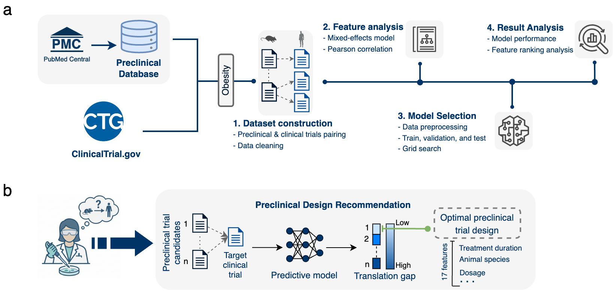

# Animal-to-human (A2H) Translation (Preclinical Database and Obesity case study)

The preclinical database (PCDB) is an open-source database derived from the biomedical literature database, PubMed Central (PMC), and linked diseases, drug compounds, and animal species entities to public databases. Large language models were applied to filter publications searched through PMC via query templates with MeSH disease concepts and extracted entity mentions in the publications. All entites were linked and standardized to the public database based on their ontology structure to ensure proper semantic categories (e.g., disease entities are under MeSH Diseases category). As a case study, we connected preclinical evidence for Obesity drug development to corresponding clinical studies and identified key factors for lowering translation gaps.

This repository focuses on reproducible PCDB construction, including the entity linking and validation logics. It also provides analysis code for the A2H Obesity dataset for generating the insights presented in the research project publication.



## Directories

- [`data/obesity`](./data/obesity) contains the raw data for the obesity case study used in this project.
- [`data/PCDB`](./data/PCDB) contains only instructions for downloading the database due to the large data size.
- [`outputs`](./outputs/) contains the outputs generated by the code.
- [`scripts`](./scripts/) contains the shell scripts used in this project.
- [`src`](./src/) contains the Python source code used in this project.

## Getting Started
The pipeline is routinely exercised on Ubuntu 22.04 with Python 3.11. The steps below assume a Conda-based workflow; feel free to adapt them to your environment management tool of choice.

### Clone the repository
```console
git clone https://github.com/IBPA/A2H_PCDB_Obesity.git
cd A2H_PCDB_Obesity
```

### Create and activate a Conda environment
```console
conda create -n A2H_PCDB_obesity python=3.11.9
conda activate A2H_PCDB_obesity
```
You can leave the environment at any point with `conda deactivate`.

### Install Python dependencies
```console
pip install -r requirements.txt
```

## PCDB Construction
```console
sh scripts/run_external_db_mapping.sh
sh scripts/create_PCDB.sh
```
Additional data files need to be downloaded first (see data/PCDB/README.md) to run the construction code.

## Generate A2H obesity visualizations:
### Exploratory data analysis
```console
sh scripts/plot_a2h_obesity_eda.sh
```
### Analysis on machine learning model:
```console
sh scripts/plot_a2h_obesity_model_analysis.sh
```
### Machine learning model performance analysis:
```console
sh scripts/run_cross_drug_analysis.sh
sh scripts/plot_a2h_obesity_model_performance.sh
```
### (Optional) Reproduce the model selection pipeline.
```console
./scripts/run_msap.sh
```
Note that this script is dependent on the MSAP pipeline internally used by the authors. For this reason, you will not be able to run this script unless you have access to the MSAP pipeline.


## Authors
- Kaichi Xie — Graduate Student<sup>1,2,3</sup>
- Riyan Townsley — undergraduate Student<sup>1,3</sup>
- Ilias Tagkopoulos — Principal Investigator<sup>1,2,3</sup>

<sup>1</sup> Department of Computer Science, University of California at Davis
<sup>2</sup> Genome Center, University of California at Davis
<sup>3</sup> USDA/NSF AI Institute for Next Generation Food Systems (AIFS)

## Contact
Questions, bug reports, and collaboration ideas are welcome at Kaichi Xie (`kcxie@ucdavis.edu`) or Prof. Ilias Tagkopoulos (`itagkopoulos@ucdavis.edu`).

## Citation
If you use A2H or PCDB in your research, please cite.

## License
 released under the Apache-2.0 License. See [`LICENSE`](./LICENSE) for the full text and usage terms.


## Funding
This work is supported by the USDA-NIFA AI Institute for Next Generation Food Systems (AIFS), USDA-NIFA award number 2020-67021-32855.
