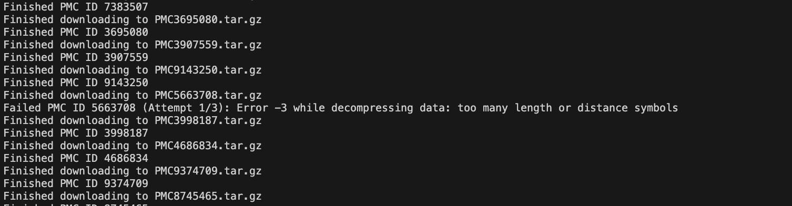

# PMC Article Scraping Toolkit

This toolkit processes biomedical research articles from PubMed Central (PMC) to extract full-text content and clean figure captions using asynchronous scraping. It includes tools for downloading article archives, parsing XML metadata, and generating structured text outputs


## 🔧 Prerequisites

- Python 3.10 or higher
- Required Python libraries listed in `requirements.txt`


### Using `venv` (built-in)
```bash
python3 -m venv example
source example/bin/activate  # On Windows: venv\Scripts\activate
pip install -r requirements.txt

```

### Using `conda` 
```bash
conda create -n example python=3.10
conda activate example
pip install -r requirements.txt

```


---

## 📁 Files Overview

### `scraper.py`
- **Purpose:** Core scraping class that handles fetching, parsing, and extracting full-text and figure captions from PMC articles using their XML metadata or .tar.gz archives

- **Key Features:**
    - Downloads `.tar.gz` archives of full PMC articles using asynchronous FTP (aioftp)
    - Parses full-article text from JATS XML format with cleaned references
    - Extracts and reformats figure captions from article metadata 

- **Input:** PMC ID (e.g., `9796023`)
- **Output:** Extracted XML text, figure captions, and optionally unzipped article contents.

### `scrape_figures.py`
- **Purpose:** Asynchronous script that processes multiple PMC articles in parallel, extracting and saving figure captions with retry handling and concurrency limits

- **Key Features:**
    - Loads PMC IDs from CSV and initiates concurrent downloads using asyncio and semaphores
    - Retries failed downloads with exponential backoff and jitter
    - Cleans and saves each figure caption as a separate file within structured output folders

- **Input:** CSV file containing a pmcid column (e.g., `articles.csv`)
- **Output:** One folder per article with caption `.txt` files (`Figure_1_Caption.txt`, etc.) and figure files (`.gif`,`.png`,etc.)

---

## 📊 Data Files

| File Name           | Description |
|---------------------|-------------|
| `../../data/cleaned_t2dm_a2h.tsv` | Structured dataset with preclinical-clinical study pairs and treatment outcome metadata |


---

## 🚀 How to Run

Run the script as follows: 

```bash
# Example: Runs script for t2dm_a2h dataset and organizes into /test directory
python3 scrape_figures.py ../../data/cleaned_t2dm_a2h.tsv test
```

---
## 📸 Example Run 



---

## 📌 Notes
- The input CSV/TSV for `scrape_figures.py` must include a `pmcid` column with values formatted like `"PMC1823903"`.
- The first few articles may experience timeouts due to cold-start (e.g., no Python bytecode cache, fresh network/FTP session setup). This typically resolves after initial retries (try again after `__pycache__` compiles) or increasing the timeout threshold.

---

## 📫 Contact

